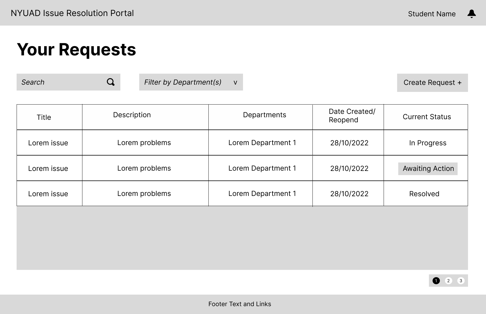
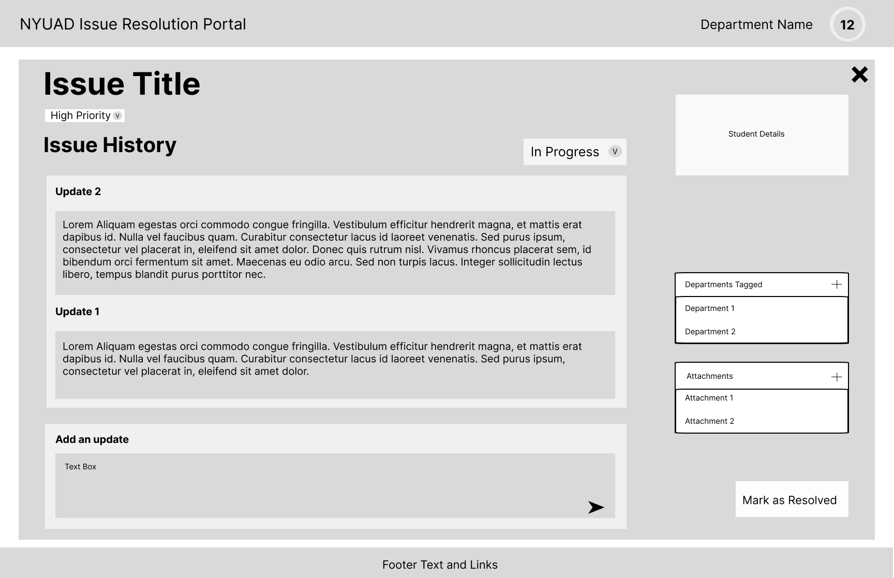
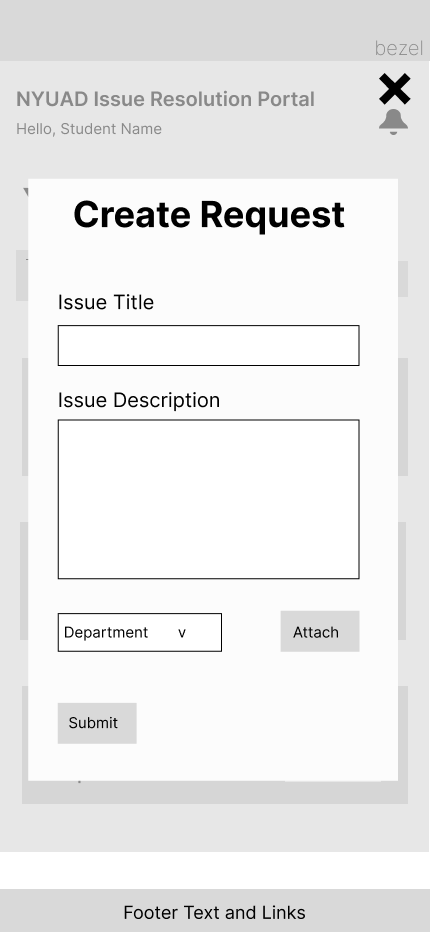

# User Experience Design

This repository contains instructions and files for two assignments that together comprise the user experience design phase of a web app.

- [Figma prototype](ux-design/prototype/readme.md)

***

## App/Site Map

The NYUAD Issue Resolution Portal sitemap has two main views: the Student Login View and the Admin Login View.

- Student Login View

    - Student Dashboard: This is the main page for students to view their issues and submit new issues.
    
    - View Issue Overlay: This overlay allows students to view the details of a specific issue.
    
    - Create New Issue Overlay: This overlay allows students to submit a new issue.

- Admin Login View

    - Department Dashboard: This is the main page for administrators to view all issues submitted by students in their department.

    - View Issue Overlay: This overlay allows administrators to view the details of a specific issue.

***

## Wireframe

### Desktop Wireframe

- Homepage 
    

    

    Admin and Student Login Portal

- Student View
    

    

    

    

    

    The Students can create new issues and check their old issues' status. Students can tag relevant departments while creating the issue.

- Admin View
    

    

    

    

    Departments' can see all the tagged issues. Department can comment on the issue and provide a solution. Deparment can can change the priority level of the issues. One department can delegate the issue to another department. 

### Mobile Wireframe

- Student View
    

    

    

    

    
