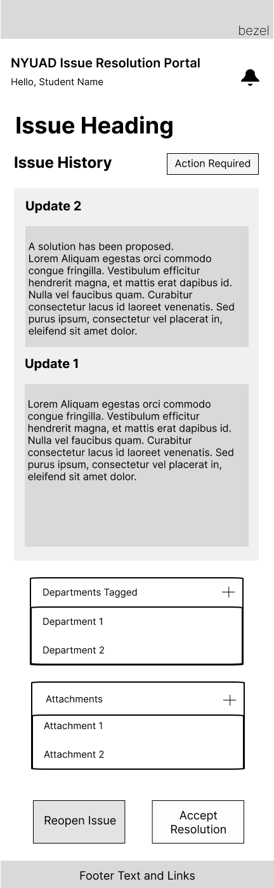

# User Experience Design

This repository contains instructions and files for two assignments that together comprise the user experience design phase of a web app.

- [Figma prototype](ux-design/prototype/readme.md)

***

## App/Site Map

The NYUAD Issue Resolution Portal sitemap has two main views: the Student Login View and the Admin Login View.

- Student Login View

    - Student Dashboard: This is the main page for students to view their issues and submit new issues.
    
    - View Issue Overlay: This overlay allows students to view the details of a specific issue.
    
    - Create New Issue Overlay: This overlay allows students to submit a new issue.

- Admin Login View

    - Department Dashboard: This is the main page for administrators to view all issues submitted by students in their department.

    - View Issue Overlay: This overlay allows administrators to view the details of a specific issue.

***

## Wireframe

### Desktop Wireframe

- **Homepage**
    

    

    Admin and Student Login Portal

- **Student View**
    
    Student Dashboard
    * Search bar: This allows students to search for specific requests by title or description.

    * Filter by department: This allows students to filter their requests by department, which can be helpful if they have a lot of requests or if they are looking for a specific type of request.

    * Create request button: This allows students to create a new request.

    * Table of requests: This table shows all of the student's requests, along with their titles, descriptions, departments, and current statuses.

    
    Department Filter Option for Students

    
    Create Request Option for Students
    * Issue Title: This is the title of the request. 
    * Issue Description: This is a more detailed description of the issue. The student should include all of the relevant information, such as when the issue started, what steps they have already taken to try to resolve it, and any error messages they have received.
    * Department: This is the department that the student is requesting assistance from. The student should select the department that is most relevant to their issue.
    * Attach: This button allows the student to attach any relevant files to their request, such as screenshots, error logs, or documents.
    * Submit: This button submits the request to the selected department.

    
    Department selection option for students

    
    Issue Details
    * Update: This shows the details of each update, such as who made the update, what they updated, and any additional comments.
    * Department Tagged: This shows the departments working on the issue.
    * Attachments: This shows the attachments of the issue.
    * Add an comment: This allows the students to add comments on the updates.
    * Reopen Issue: This allows the student to request the department to reopen the issue if they believe it was not resolved. 
    * Accept Resolution: This allows the student to accept the solution provided by the departments.

- **Admin View**
    
    Admin Dashboard

    
    Issue Details
    * Update: This shows the details of each update, such as who made the update, what they updated, and any additional comments.
    * Department Tagged: This shows the departments working on the issue. Department can also delegate the issue to a different departments.
    * Attachments: This shows the attachments of the issue.
    * Add an update: This allows the admin to add updates on the updates.
    * Mark as Resolved: This allows the admin to propose the solution and mark the issue as resolved

    
    Issue Status Selection
    * This allows the department to change the progress of the issue

    
    Issue Priority Selection
    * This allows the department to change the priority of the issue. 

### Mobile Wireframe

- Student View

    

    

    

    

    
